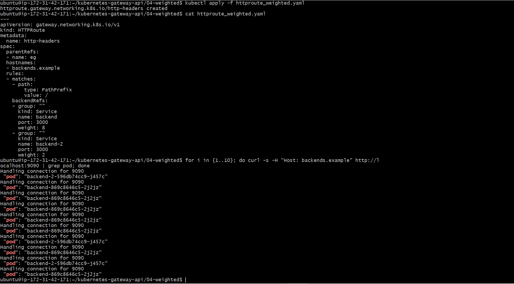
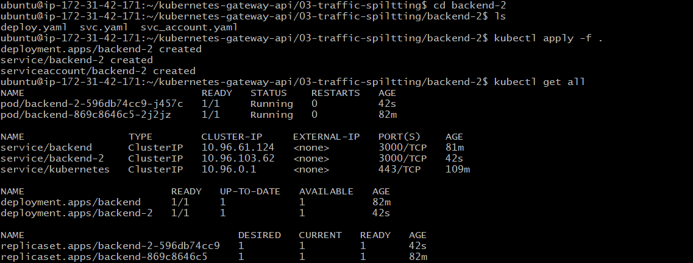

# Kubernetes Gateway API Practical Lab 🚀

This repository contains my hands-on practice with the modern **Kubernetes Gateway API**. I used this project to move beyond traditional Ingress and explore role-oriented traffic management.

## 🛠 Features Explored
* **Basic Gateway Setup:** Configuring the GatewayClass and Gateway.
* **URL Rewriting:** Dynamically modifying request paths.
* **Traffic Splitting:** Distributing load between multiple service versions.
* **Weighted Routing (Canary):** Implementing 80/20 traffic shifts for safe deployments.

## 📸 Lab Results & Architecture

### 1. URL Rewrite Logic
!https://ahrefs.com/writing-tools/paragraph-rewriter(gatewayrewrite.PNG)
### 2. Weighted Traffic Distribution (80/20)

### 3. Traffic Splitting

## 🏗 Technology Stack
* **Kubernetes** (Ubuntu Cluster)
* **Gateway API** (Envoy/Gateway Controller)
* **Linux/Bash**
